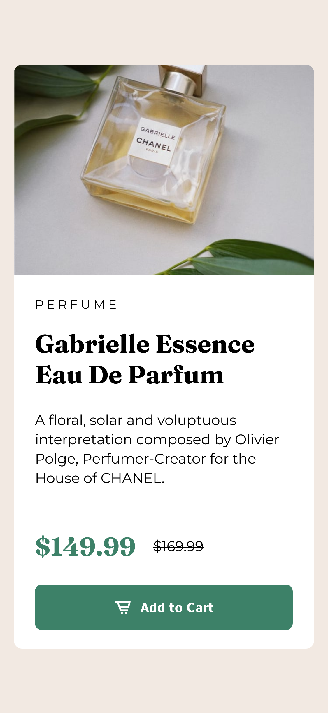

# Frontend Mentor - Product preview card component solution

This is a solution to the [Product preview card component challenge on Frontend Mentor](https://www.frontendmentor.io/challenges/product-preview-card-component-GO7UmttRfa). Frontend Mentor challenges help you improve your coding skills by building realistic projects. 

## Table of contents

- [Overview](#overview)
  - [The challenge](#the-challenge)
  - [Screenshot](#screenshot)
  - [Links](#links)
- [My process](#my-process)
  - [Built with](#built-with)
  - [What I learned](#what-i-learned)
  - [Continued development](#continued-development)
  - [Useful resources](#useful-resources)
- [Author](#author)
- [Acknowledgments](#acknowledgments)

**Note: Delete this note and update the table of contents based on what sections you keep.**

## Overview

### The challenge

Users should be able to:

- View the optimal layout depending on their device's screen size
- See hover and focus states for interactive elements

### Screenshot

### Links

- Solution URL: [Add solution URL here](https://github.com/tchydy/Product-preview-card-component)
- Live Site URL: [Add live site URL here](https://tchydy.github.io/Product-preview-card-component/)

## My process

### Built with

- Semantic HTML5 markup
- CSS custom properties
- Flexbox
- CSS Grid
- Mobile-first workflow

### What I learned

Major learnings
- Centering an elemement in the middle of a page
- Getting the images for mobile and desktop change for different sizes
- Using Adobe XD to layout design
- Translating Xd styles to CSS
- Hover and focus states for button

### Continued development

Add anaimations and interactivity to the project elements.

### Useful resources

- [Xd styles to CSS](https://codepen.io/raunaqpatel/full/bGpwBvo) - This helped me to translate Xd letter spacing styles to CSS

## Author

- Frontend Mentor - [@tchydy](https://www.frontendmentor.io/profile/tchydy)

 
